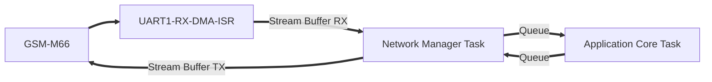

> # Proje Tasarımı - QUECTEL M66 GSM Modülü
---

---
- **UART1 paylaşımı**: printf (debug) ve GSM modülü ortak UART1 kullanır. TX Mutex ile korunur.
- **RX Yönü**: GSM -> UART1 RX -> DMA -> ISR -> Stream Buffer -> Network Manager Task
- **TX Yönü**: Network Manager Task -> Stream Buffer -> DMA/UART1 TX -> GSM
- **Application Core**: AT komutu yanıtlarını parse eder.
- Proje tasarımı **FreeRTOS** ile yapılacak (Nuvoton M031 / ARM Cortex-M0).