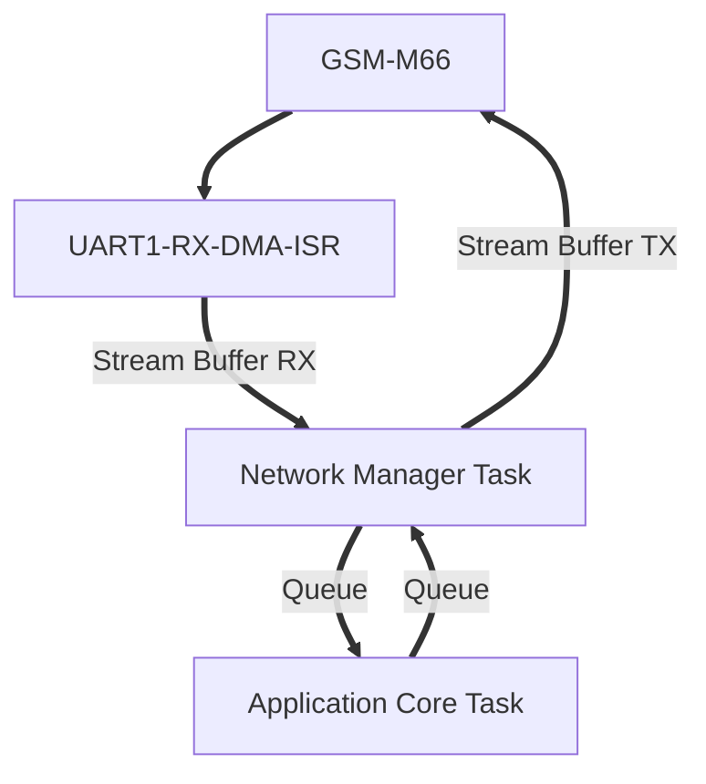

> # *Proje Tasarımı* 
---

---
- **UART0**: GSM modülü ortak UART0 kullanır.
- **UART1**: printf (debug) işlemlerini UART1 yapar.
- **RX Yönü**: GSM -> UART1 RX -> DMA -> ISR -> Stream Buffer -> Network Manager Task.
- **TX Yönü**: Network Manager Task -> Stream Buffer -> DMA/UART1 TX -> GSM
- **Application Core**: AT komutu yanıtlarını parse eder.
- Proje tasarımı **FreeRTOS** (Nuvoton M032 / ARM Cortex-M0).